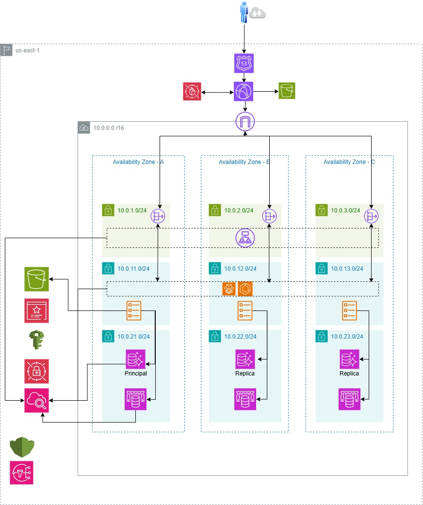

# Solución E-Commerce Escalable en AWS - JFC

## Descripción General

Implementación de infraestructura cloud para aplicación de e-commerce de tres capas (Frontend, Backend, Datos) en AWS, utilizando arquitectura serverless y microservicios para garantizar escalabilidad, alta disponibilidad y optimización de costos.

## Arquitectura Propuesta



### Componentes Principales

**Frontend (Capa de Presentación)**
- Amazon CloudFront + S3 para hosting estático
- AWS WAF para protección contra ataques
- Route 53 para DNS y routing

**Backend (Capa de Aplicación)**
- Amazon ECS Fargate para microservicios containerizados
- Application Load Balancer (ALB) para distribución de tráfico
- Amazon ElastiCache (Redis) para caché distribuido

**Datos (Capa de Persistencia)**
- Amazon Aurora Serverless v2 (PostgreSQL) para todos los datos transaccionales y sesiones
- Amazon S3 para almacenamiento de imágenes y assets
- Amazon ElastiCache (Redis) para caché de alto rendimiento

**Observabilidad y Seguridad**
- Amazon CloudWatch para logs y métricas
- AWS X-Ray para tracing distribuido
- AWS Secrets Manager para credenciales
- AWS KMS para encriptación
- Amazon SNS/SQS para notificaciones y mensajería

## Estructura del Proyecto

```
.
├── README.md
├── JFC.jpg                          # Diagrama de arquitectura
├── IaC/                             # Infraestructura como Código (Terraform)
│   ├── main.tf
│   ├── variables.tf
│   ├── outputs.tf
│   ├── terraform.tfvars
│   ├── modules/
│   │   ├── networking/              # VPC, Subnets, NAT Gateway
│   │   ├── security/                # Security Groups, IAM
│   │   ├── dns/                     # Route 53
│   │   ├── frontend/                # CloudFront, S3
│   │   ├── waf/                     # Web Application Firewall
│   │   ├── backend/                 # ECS Fargate, ALB
│   │   ├── database/                # Aurora Serverless v2
│   │   ├── cache/                   # ElastiCache Redis
│   │   └── monitoring/              # CloudWatch, X-Ray
│   └── environments/
│       ├── dev/                     # Entorno de desarrollo
│       ├── qa/                      # Entorno de QA/Staging
│       └── prod/                    # Entorno de producción
└── .github/
    └── workflows/                   # GitHub Actions (CI/CD)
```


## Principios de Diseño Aplicados

1. **Well-Architected Framework**: Pilares de seguridad, confiabilidad, eficiencia de rendimiento, optimización de costos y excelencia operacional
2. **Serverless First**: Minimizar gestión de infraestructura
3. **Multi-AZ**: Alta disponibilidad en múltiples zonas (3 AZs)
4. **Auto-scaling**: Escalabilidad automática basada en demanda
5. **Security by Design**: Seguridad en todas las capas
6. **Infrastructure as Code**: Reproducibilidad y versionamiento con Terraform

## Características Clave

✅ **Escalabilidad**: Auto-scaling en todas las capas (ECS, Aurora, Redis)

✅ **Alta Disponibilidad**: Multi-AZ con SLA 99.99%, failover automático

✅ **Rendimiento**: Caché multinivel (CloudFront + Redis), CDN global

✅ **Seguridad**: Encriptación end-to-end, WAF, Secrets Manager, IAM

✅ **Observabilidad**: Logs centralizados, métricas, tracing con X-Ray

✅ **Optimización de Costos**: Pay-per-use, serverless, auto-scaling

✅ **Gestión Simplificada**: Servicios administrados, sin gestión de servidores

## Despliegue Rápido

```bash
# 1. Configurar credenciales AWS
aws configure

# 2. Inicializar Terraform
cd IaC/environments/prod
terraform init

# 3. Revisar plan de infraestructura
terraform plan

# 4. Aplicar infraestructura
terraform apply

# 5. Obtener outputs (endpoints, DNS, etc.)
terraform output
```

## Estimación de Costos

**Calculadora AWS**: [Ver estimación completa](https://calculator.aws/#/estimate?id=626e14764eb797ccbebfae2a0d42c8d3b422d6b3)


*Los costos varían según el tráfico y uso real. La estimación incluye todos los servicios AWS necesarios.*

## Servicios AWS Utilizados

| Categoría | Servicios |
|-----------|-----------|
| **Networking** | VPC, Subnets, NAT Gateway (3), Internet Gateway, Route 53 |
| **Seguridad** | WAF, Security Groups, Secrets Manager, KMS, IAM |
| **Frontend** | CloudFront, S3 |
| **Backend** | ECS Fargate, Application Load Balancer, ECR |
| **Datos** | Aurora Serverless v2 (PostgreSQL), ElastiCache Redis, S3 |
| **Monitoreo** | CloudWatch, X-Ray, SNS |


## Requisitos Previos

- AWS CLI configurado con credenciales válidas
- Terraform >= 1.5.0 instalado
- Cuenta AWS con permisos de administrador
- Dominio registrado (opcional, para Route 53)
- Certificado SSL en ACM (opcional, para HTTPS)

## Variables de Configuración

Las variables principales se configuran en `IaC/terraform.tfvars`:

```hcl
# General
project_name = "jfc-ecommerce"
environment  = "prod"
aws_region   = "us-east-1"

# Networking
vpc_cidr           = "10.0.0.0/16"
enable_nat_gateway = true

# Frontend
domain_name = "jfc-ecommerce.com"

# Database
database_name           = "jfcecommerce"
aurora_min_capacity     = 0.5
aurora_max_capacity     = 16
backup_retention_period = 7

# Cache
redis_node_type = "cache.t4g.medium"
redis_num_nodes = 3

# ECS
ecs_task_cpu    = 512
ecs_task_memory = 1024
ecs_min_tasks   = 2
ecs_max_tasks   = 10
```

## Seguridad

- **Encriptación**: Todos los datos encriptados en tránsito (TLS 1.3) y en reposo (KMS)
- **WAF**: Protección contra SQL injection, XSS, rate limiting
- **Secrets Manager**: Credenciales rotadas automáticamente cada 30 días
- **IAM**: Roles con principio de least privilege
- **Network**: Subnets privadas sin acceso directo a internet
- **Compliance**: Arquitectura compatible con PCI DSS y GDPR

## Monitoreo y Alertas

- **CloudWatch Dashboards**: Métricas en tiempo real de todos los servicios
- **Alarmas**: 20+ alarmas configuradas para eventos críticos
- **X-Ray**: Tracing distribuido para análisis de rendimiento
- **Logs**: Centralizados en CloudWatch con retención de 30 días
- **SNS**: Notificaciones por email para alertas críticas

## Alta Disponibilidad

- **Multi-AZ**: Todos los componentes distribuidos en 3 Availability Zones
- **Failover Automático**: Aurora y Redis con failover < 30 segundos
- **Health Checks**: ALB y Route 53 con health checks activos
- **Auto-Healing**: ECS reemplaza automáticamente tasks no saludables
- **Backups**: Automáticos diarios con retención de 7 días


## Escalabilidad

### Auto-Scaling Configurado

**ECS Fargate**:
- Escalado basado en CPU (> 70%) y Memory (> 80%)
- Min: 2 tasks, Max: 10 tasks por servicio
- Scale-out: 2 minutos, Scale-in: 5 minutos

**Aurora Serverless v2**:
- Escalado automático de 0.5 a 16 ACUs
- Basado en carga de CPU y conexiones
- Escalado en segundos sin downtime

**ElastiCache Redis**:
- 3 nodos distribuidos en 3 AZs
- Escalado vertical (cambio de tipo de nodo)
- Escalado horizontal (agregar réplicas)

## Disaster Recovery

- **RTO** (Recovery Time Objective): < 1 hora
- **RPO** (Recovery Point Objective): < 15 minutos
- **Backups**: Automáticos diarios de Aurora y Redis
- **Snapshots**: Manuales antes de cambios críticos
- **Multi-Region**: Preparado para replicación cross-region (opcional)

## CI/CD (Opcional)

El proyecto está preparado para integración con:

- **GitHub Actions**: Workflows en `.github/workflows/`
- **AWS CodePipeline**: Pipeline de despliegue automatizado
- **Terraform Cloud**: State management remoto y colaborativo

### Monitoreo Continuo
- Métricas en tiempo real
- Alertas proactivas
- Logs centralizados

## Licencia

Este proyecto es propiedad de JFC E-Commerce Platform.

## Autor

**Sebastián Barón Rivera**

---

**Última actualización**: Marzo 2026  
**Versión**: 1.0  
**Región AWS**: us-east-1 (N. Virginia)
